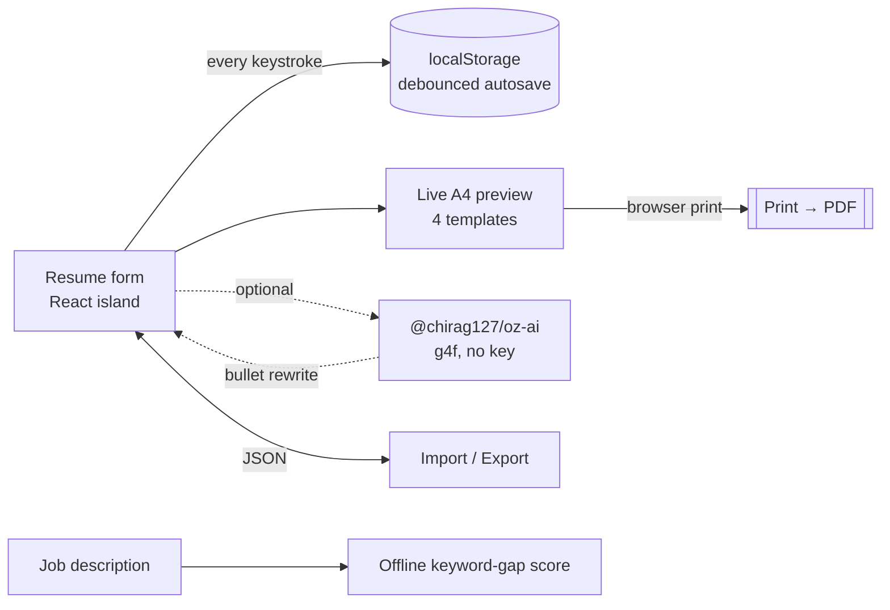

# oriz-resume

> ATS-clean resume builder that runs entirely in your browser — form in, typeset PDF out.

[](./LICENSE)
[](https://github.com/chirag127/oriz-resume/stargazers)
[](https://github.com/chirag127/oriz-resume/commits/main)
[](https://astro.build)
[](https://resume.oriz.in)

- **Live app:** https://resume.oriz.in _(canonical — Cloudflare Pages)_
- **About / info:** https://chirag127.github.io/oriz-resume/ _(GitHub Pages landing)_
- **Repo:** https://github.com/chirag127/oriz-resume
- **llms.txt:** https://resume.oriz.in/llms.txt

ATS-clean resume builder that runs entirely in your browser. Fill a form, watch it typeset live, print straight to PDF. Four templates, JSON import/export, localStorage autosave, optional AI bullet-polishing.

> **100% client-side. No upload. No signup. Free.** Everything runs in the browser and is saved only to your own `localStorage`. Your resume never touches a server.

**⭐ If this is useful, please [star the repo](https://github.com/chirag127/oriz-resume/stargazers) — it helps others find it.**

## How it works



## Features

- **Live preview** — every keystroke re-typesets the printable A4 sheet.
- **4 ATS-clean templates** — Ledger (editorial serif), Compact, Modern, Classic — plus 6 accent colors.
- **Print → PDF** — browser print with a scoped print stylesheet; pixel-clean output.
- **Autosave** — debounced save to `localStorage`; reload and your draft is there.
- **Import / export JSON** — move a resume between machines; portable, human-readable.
- **Job-match check** — paste a job description for an instant, offline keyword-gap score.
- **Optional AI** — rewrite a bullet stronger, or tailor it to a pasted job description, via [`@chirag127/oz-ai`](https://github.com/chirag127/design-system) (g4f, multi-provider failover, no key). If AI is down, the core builder works unchanged.

## Stack

Astro (static) + React 19 islands + Tailwind v4. PWA-installable. Shared atomic packages: `@chirag127/oz-ai`, `@chirag127/oz-file`, `@chirag127/oz-tokens-base`, `@chirag127/oz-chrome`. AI is lazy-imported only when triggered, so it stays off the initial bundle.

## Develop

```bash
npm install --legacy-peer-deps
npm run dev      # local
npm test         # vitest — pure logic (keyword gap, storage coercion, round-trip)
npm run build    # static build → dist/
npm run deploy   # build + wrangler pages deploy
```

Windows note: use **npm**, not pnpm (pnpm skips `@esbuild/win32-x64` and the build crashes).

## Part of the oriz family

One of ~80 small, fast, single-purpose tools and sites in the **oriz** fleet — see [blog.oriz.in](https://blog.oriz.in) for how the whole thing is built and run solo. Sibling tools: [json.oriz.in](https://json.oriz.in) · [diagram.oriz.in](https://diagram.oriz.in) · [case.oriz.in](https://case.oriz.in) · [name.oriz.in](https://name.oriz.in) · [muse.oriz.in](https://muse.oriz.in).

**Cost:** $0 — static build hosted free on Cloudflare Pages; AI is keyless (g4f) and client-side.

## Contributing

Issues and PRs welcome. Conventional commits are the changelog.

## Author

Chirag Singhal · chirag@oriz.in

## Status

Stable.

## License

MIT © 2026 Chirag Singhal
